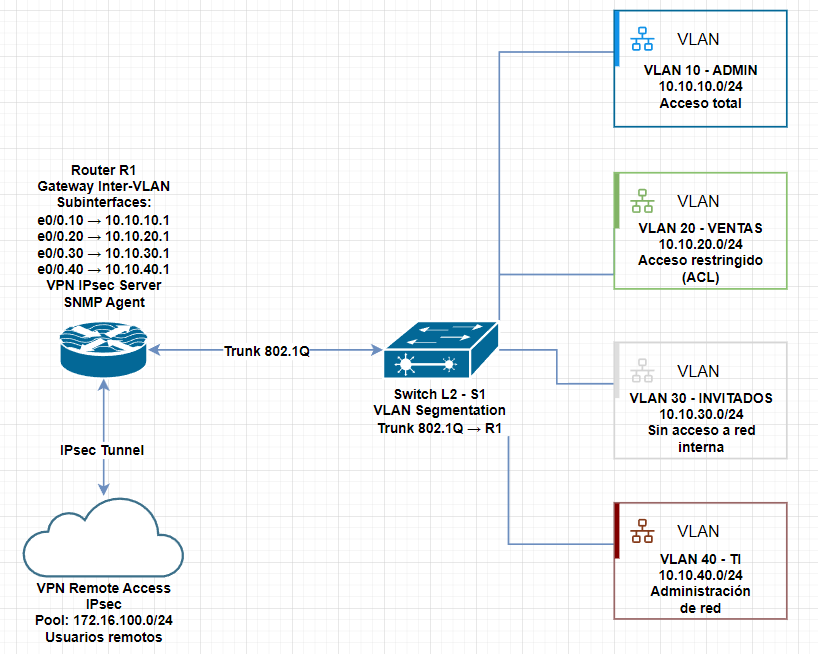
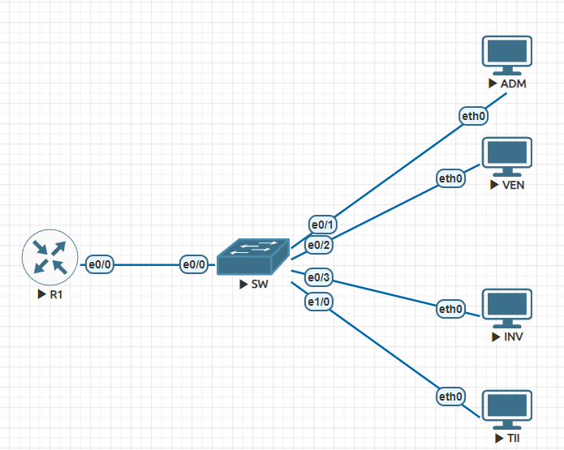
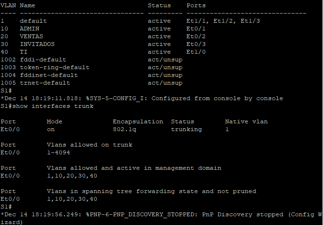
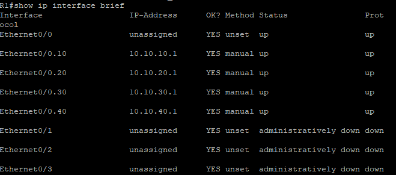
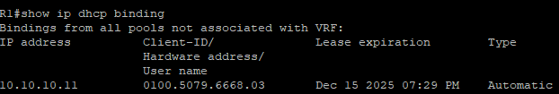
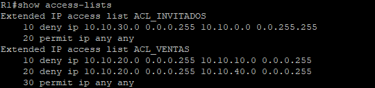
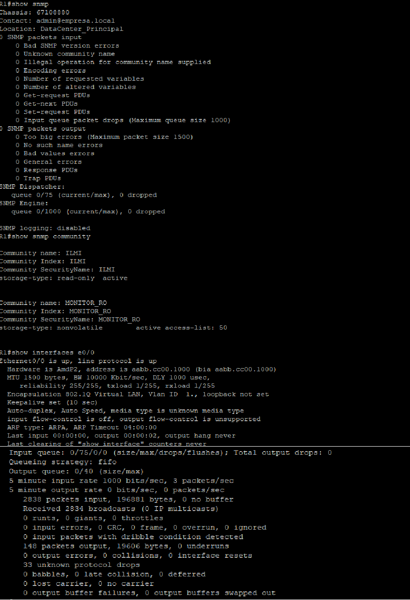
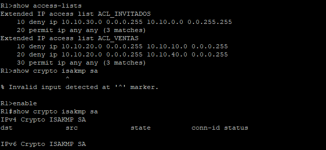

# 🌐 Red Corporativa Segmentada con VLANs, Seguridad, VPN y Monitoreo

[](https://www.cisco.com/)
[](https://www.eve-ng.net/)
[](https://github.com)

> **Proyecto de infraestructura de red empresarial** que desarrollé para demostrar mis competencias técnicas reales en **switching, routing, seguridad, VPN y monitoreo** de redes. Diseñado como evidencia práctica para posiciones de **Redes Junior** e **Infraestructura TI**.

---

## 📋 Tabla de Contenidos

- [🎯 Resumen del Proyecto](#-resumen-del-proyecto)
- [💼 Competencias Demostradas](#-competencias-demostradas)
- [🏗️ Arquitectura de la Red](#️-arquitectura-de-la-red)
- [🔧 Tecnologías Implementadas](#-tecnologías-implementadas)
- [🔐 Seguridad y Políticas de Acceso](#-seguridad-y-políticas-de-acceso)
- [🌍 VPN de Acceso Remoto](#-vpn-de-acceso-remoto)
- [📊 Monitoreo con SNMP](#-monitoreo-con-snmp)
- [✅ Validación y Pruebas](#-validación-y-pruebas)
- [🛠️ Entorno de Desarrollo](#️-entorno-de-desarrollo)
- [📂 Estructura del Repositorio](#-estructura-del-repositorio)
- [📚 Documentación Adicional](#-documentación-adicional)

---

## 🎯 Resumen del Proyecto

Desarrollé una **red corporativa segmentada** en un entorno simulado que replica un escenario empresarial real. El proyecto abarca desde el diseño de la topología hasta la implementación de servicios, políticas de seguridad, acceso remoto y monitoreo.

### 🎪 Características Principales

- ✅ **Segmentación por VLANs** - 4 áreas departamentales aisladas
- ✅ **Enrutamiento Inter-VLAN** - Router-on-a-Stick con 802.1Q
- ✅ **Servicios de Red** - DHCP centralizado por VLAN
- ✅ **Seguridad Avanzada** - ACLs extendidas con políticas diferenciadas
- ✅ **Acceso Remoto Seguro** - VPN IPsec con cifrado AES
- ✅ **Monitoreo Empresarial** - SNMP v2c con control de acceso

> [!NOTE]
> Desarrollé este proyecto completamente por mí mismo utilizando **equipos Cisco reales** (imágenes IOS) en EVE-NG, replicando un entorno de producción empresarial.

---

## 💼 Competencias Demostradas

A través de este proyecto demuestro mi dominio práctico en las siguientes áreas técnicas:

| Área | Tecnologías |
|------|-------------|
| **Switching** | VLANs, Trunking 802.1Q, STP |
| **Routing** | Router-on-a-Stick, enrutamiento inter-VLAN |
| **Servicios** | DHCP Server, pools dinámicos |
| **Seguridad** | ACLs extendidas, segmentación de red |
| **VPN** | IPsec, acceso remoto, cifrado AES |
| **Monitoreo** | SNMP v2c, gestión de infraestructura |
| **Documentación** | Documentación técnica profesional |

---

## 🏗️ Arquitectura de la Red

### 📊 Topología Lógica

Diseñé la red con una **arquitectura jerárquica** utilizando el modelo **Router-on-a-Stick** para optimizar recursos.



### 🗺️ Topología Física



### 🏢 Segmentación por Departamentos

Implementé **4 VLANs** para segmentar la red corporativa según áreas funcionales:

| VLAN | Departamento | Red | Gateway | Propósito |
|------|--------------|-----|---------|-----------|
| **10** | **Administración** | `10.10.10.0/24` | `10.10.10.1` | Área administrativa sensible |
| **20** | **Ventas** | `10.10.20.0/24` | `10.10.20.1` | Equipo comercial |
| **30** | **Invitados** | `10.10.30.0/24` | `10.10.30.1` | Red aislada para visitantes |
| **40** | **TI** | `10.10.40.0/24` | `10.10.40.1` | Infraestructura y soporte |



> [!NOTE]
> La segmentación por VLANs que implementé permite **aislar el tráfico** entre departamentos, reduciendo la superficie de ataque y mejorando el rendimiento de la red.

### 🔀 Enrutamiento Inter-VLAN

Configuré el **Router R1** con subinterfaces para permitir la comunicación controlada entre VLANs:



**Configuración que implementé:**
- `encapsulation dot1Q` en cada subinterfaz
- Dirección IP como **gateway** de cada VLAN
- Enlace **trunk 802.1Q** entre router y switch

---

## 🔧 Tecnologías Implementadas

### 1️⃣ Servicio DHCP Centralizado

Configuré el **router como servidor DHCP** para asignar dinámicamente direcciones IP a los dispositivos de cada VLAN.



**Características que implementé:**
- ✅ 4 pools DHCP independientes (uno por VLAN)
- ✅ Rangos excluidos para dispositivos de red
- ✅ DNS y domain-name configurados
- ✅ Asignación automática de gateway

**Ejemplo de mi configuración:**
```cisco
ip dhcp pool VLAN10_ADMIN
 network 10.10.10.0 255.255.255.0
 default-router 10.10.10.1
 dns-server 8.8.8.8
 domain-name empresa.local
```

---

## 🔐 Seguridad y Políticas de Acceso

Implementé una **estrategia de seguridad en capas** utilizando ACLs extendidas para controlar el tráfico entre VLANs.



### 🛡️ Políticas de Seguridad que Definí

| Origen | Destino Permitido | Destino Bloqueado | Justificación |
|--------|-------------------|-------------------|---------------|
| **Administración** | ✅ Todas las VLANs | - | Acceso completo administrativo |
| **TI** | ✅ Todas las VLANs | - | Soporte y monitoreo |
| **Ventas** | ✅ Internet, Ventas | ❌ Admin, TI | Protección de áreas sensibles |
| **Invitados** | ✅ Solo Internet | ❌ Todas las VLANs internas | Aislamiento total |

### 📜 ACLs que Implementé

**ACL_VENTAS** - Protege áreas críticas:
```cisco
ip access-list extended ACL_VENTAS
 deny   ip 10.10.20.0 0.0.0.255 10.10.10.0 0.0.0.255 ! Bloquea Admin
 deny   ip 10.10.20.0 0.0.0.255 10.10.40.0 0.0.0.255 ! Bloquea TI
 permit ip any any
```

**ACL_INVITADOS** - Aislamiento completo:
```cisco
ip access-list extended ACL_INVITADOS
 deny   ip 10.10.30.0 0.0.0.255 10.10.0.0 0.0.255.255 ! Bloquea red interna
 permit ip any any                                     ! Solo Internet
```

> [!NOTE]
> Apliqué las ACLs en **modo inbound** sobre las subinterfaces del router, filtrando el tráfico en el origen siguiendo las **mejores prácticas de seguridad**.

---

## 🌍 VPN de Acceso Remoto

Configuré una **VPN IPsec** para permitir acceso seguro a la red corporativa desde ubicaciones remotas.


### 🔐 Características de la VPN que Implementé

- **Protocolo:** IPsec (Internet Protocol Security)
- **Cifrado:** AES (Advanced Encryption Standard)
- **Autenticación:** Clave precompartida (PSK)
- **Pool de IPs:** `172.16.100.10 - 172.16.100.50`
- **Modo:** Acceso remoto (Road Warrior)

### ⚙️ Configuración que Implementé

```cisco
! Usuario VPN
username vpnuser secret contraseña_segura

! Pool de direcciones para clientes VPN
ip local pool VPN_POOL 172.16.100.10 172.16.100.50

! Política ISAKMP
crypto isakmp policy 10
 encr aes
 authentication pre-share
 group 2

! Clave precompartida
crypto isakmp key VPNKEY address 0.0.0.0
```

**✅ Beneficios que logré:**
- Los trabajadores remotos pueden conectarse de forma segura
- Todo el tráfico viaja **cifrado**
- Acceso transparente a recursos internos
- Confidencialidad e integridad garantizadas

---

## 📊 Monitoreo con SNMP

Implementé **SNMP v2c** para supervisar el estado del router y las interfaces de red.



### 📡 Información que Monitoreo

- ✅ **Estado de interfaces** (up/down)
- ✅ **Disponibilidad del router**
- ✅ **Tráfico de red** (paquetes entrantes/salientes)
- ✅ **Eventos del sistema** (traps SNMP)

### 🔒 Control de Acceso que Configuré

Configuré una **ACL específica** para restringir el acceso SNMP únicamente desde la **VLAN de TI** (10.10.40.0/24), evitando consultas no autorizadas.

> [!NOTE]
> El monitoreo SNMP que implementé me permite detectar problemas de conectividad de forma proactiva y recopilar métricas de rendimiento para optimizar la red.

---

## ✅ Validación y Pruebas

Realicé pruebas exhaustivas para validar el correcto funcionamiento de todos los servicios que implementé.



### 🧪 Plan de Pruebas que Ejecuté

| Prueba | Objetivo | Resultado |
|--------|----------|-----------|
| **Conectividad Intra-VLAN** | Comunicación dentro de la misma VLAN | ✅ Exitoso |
| **Conectividad Inter-VLAN** | Enrutamiento entre VLANs permitidas | ✅ Exitoso |
| **Bloqueo por ACLs** | Ventas no accede a Admin/TI | ✅ Exitoso |
| **Aislamiento de Invitados** | Red de invitados sin acceso interno | ✅ Exitoso |
| **Asignación DHCP** | IPs asignadas dinámicamente | ✅ Exitoso |
| **Conectividad VPN** | Acceso remoto seguro | ✅ Exitoso |
| **Monitoreo SNMP** | Consultas SNMP desde VLAN TI | ✅ Exitoso |

### 🔍 Comandos de Validación que Utilicé

```cisco
show vlan brief
show interfaces trunk
show ip interface brief
show ip dhcp binding
show ip access-lists
show crypto isakmp sa
show snmp community
```

---

## 🛠️ Entorno de Desarrollo

### 💻 Herramientas que Utilicé

| Herramienta | Versión/Detalle |
|-------------|-----------------|
| **Simulador** | EVE-NG Community (OVA) |
| **Sistema Base** | Linux (host de EVE-NG) |
| **Switch L2** | Cisco IOS - `i86bi_LinuxL2-AdvEnterpriseK9-M_152_May_2018.bin` |
| **Router L3** | Cisco IOS - `i86bi_LinuxL3-AdvEnterpriseK9-M2_157_3_May_2018.bin` |
| **PCs Virtuales** | 4 clientes Linux (EVE-NG) |

### 🏷️ Equipos de Red que Configuré

- **Router:** 1x Cisco R1 (IOS 15.7)
- **Switch:** 1x Cisco S1 L2 (IOS 15.2)
- **Hosts:** 4 PCs (Admin, Ventas, Invitados, TI)

---

## 📂 Estructura del Repositorio

```
Proyecto-Red-Corporativa/
│
├── 📄 README.md                          # Este archivo
│
├── 📁 capturas/                          # Evidencias visuales
│   ├── 01_vlans_creadas.png              # VLANs configuradas
│   ├── 02_subinterfaces_router.png       # Router-on-a-Stick
│   ├── 03_pools_DHCP.png                 # Servicio DHCP
│   ├── 04_ACLs_extendidas.png            # Políticas de seguridad
│   ├── 05_VPN_IPsec.png                  # VPN de acceso remoto
│   ├── 06_Monitoreo_SNMP.png             # Monitoreo de red
│   └── 07_Troubleshooting.png            # Validación final
│
├── 📁 configs/                           # Configuraciones exportadas
│   ├── router_R1.conf                    # Configuración completa del router
│   ├── switch_S1.conf                    # Configuración del switch
│   └── acl_policies.txt                  # Documentación de políticas ACL
│
├── 📁 diagramas/                         # Diagramas de red
│   ├── topologia_fisica.png              # Diagrama físico
│   └── topologia_logica.png              # Diagrama lógico
│
└── 📁 documentación/                     # Documentación técnica detallada
    ├── arquitectura.md                   # Diseño de la red
    ├── seguridad.md                      # Políticas de seguridad
    ├── vpn.md                            # Configuración VPN
    ├── snmp.md                           # Implementación SNMP
    └── pruebas_y_validacion.md           # Plan de pruebas
```

---

## 📚 Documentación Adicional

Para información técnica detallada, consulta los siguientes documentos que desarrollé:

- 📖 **[Arquitectura de la Red](documentación/arquitectura.md)** - Diseño y direccionamiento IP
- 🔒 **[Seguridad y ACLs](documentación/seguridad.md)** - Políticas de acceso implementadas
- 🌐 **[VPN de Acceso Remoto](documentación/vpn.md)** - Configuración IPsec
- 📊 **[Monitoreo SNMP](documentación/snmp.md)** - Supervisión de infraestructura
- ✅ **[Pruebas y Validación](documentación/pruebas_y_validacion.md)** - Verificaciones realizadas

---

## 🎯 Objetivos Profesionales

Desarrollé este proyecto como **evidencia práctica** de mis competencias técnicas en:

- Diseño e implementación de redes empresariales
- Configuración de equipos Cisco (CLI)
- Seguridad de infraestructura
- Servicios de red corporativos
- Documentación técnica profesional

> [!NOTE]
> **Este proyecto está orientado a demostrar mis habilidades reales**, no solo conocimientos teóricos. Lo desarrollé completamente por mí mismo y puedo presentarlo en **entrevistas técnicas** o como **portafolio profesional**.

---

## 📬 Contacto

Si tienes preguntas sobre este proyecto o deseas discutir oportunidades profesionales en redes e infraestructura, no dudes en contactarme.

---

**Desarrollado con** 💙 **por yordy-dev** | **Proyecto de Portafolio - Redes e Infraestructura**

---

<div align="center">

### ⭐ Si este proyecto te resultó útil, considera darle una estrella

</div>